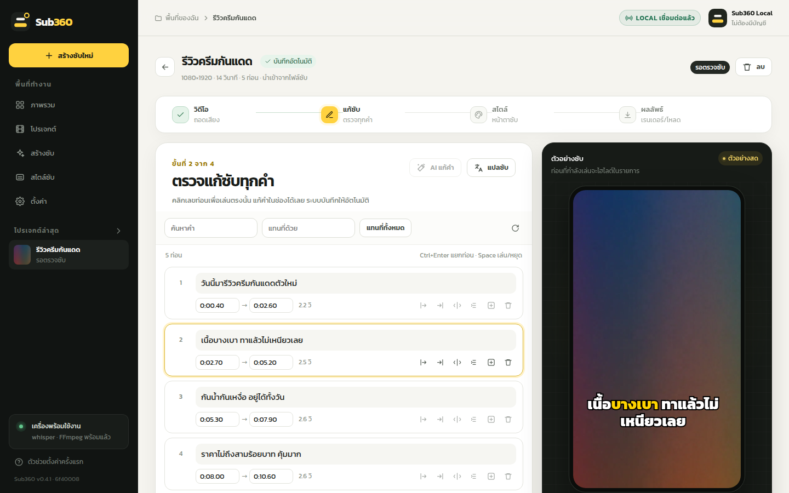
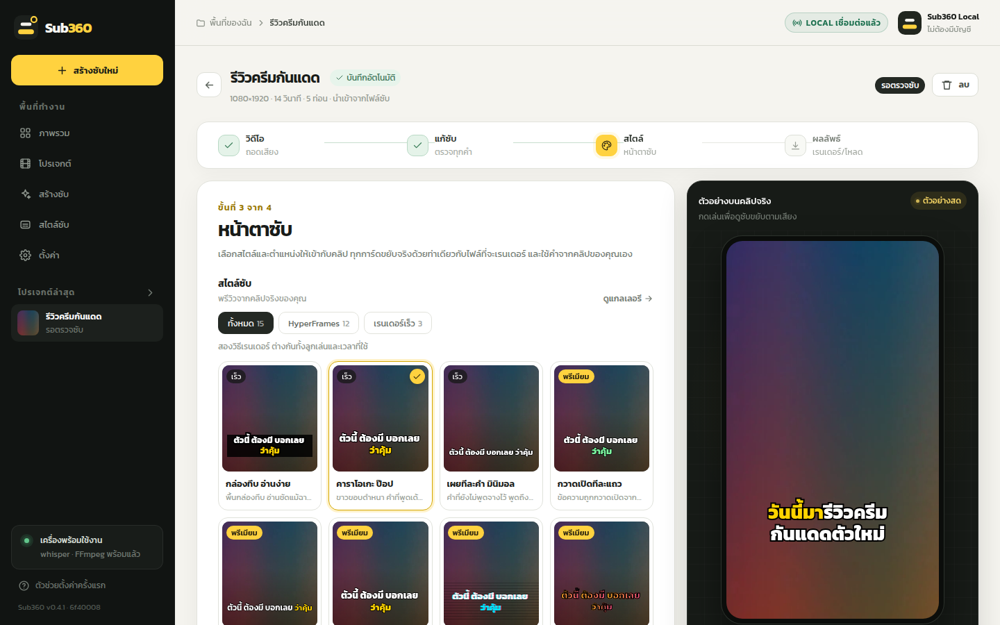
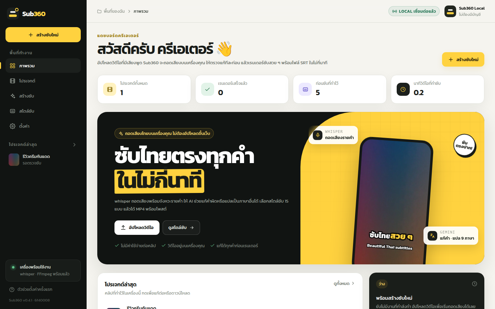

<div align="center">


# Sub360

**ถอดเสียงวิดีโอเป็นซับไทยสวย ๆ บนเครื่องของคุณเอง**<br>
อัปโหลดคลิป → ตรวจแก้ซับ → เลือกสไตล์ → ได้วิดีโอพร้อมโพสต์ ฟรี ไม่ต้องสมัครสมาชิก

<a href="https://github.com/Work360team/Sub360/releases/latest/download/Sub360-Setup.exe"></a>

<sub>ไฟล์ประมาณ 150 MB · ลิงก์นี้ได้เวอร์ชันล่าสุดเสมอ · แอปอัปเดตตัวเองเมื่อมีเวอร์ชันใหม่ · <a href="https://github.com/Work360team/Sub360/releases">ดูทุกเวอร์ชัน</a></sub>

[](https://github.com/Work360team/Sub360/releases/latest)
[](https://github.com/Work360team/Sub360/releases)


</div>

> [!TIP]
> **เปิดไฟล์ครั้งแรก** ถ้าขึ้นกล่องสีฟ้า "Windows protected your PC" ให้กด **More info** แล้วกด **Run anyway**
> ขึ้นแค่ครั้งแรก เพราะไฟล์ยังไม่ได้ลงทะเบียนชื่อผู้พัฒนากับ Microsoft

<p align="center"></p>

## ลองใช้ใน 3 ขั้น

1. **ดาวน์โหลดแล้วดับเบิลคลิก** [`Sub360-Setup.exe`](https://github.com/Work360team/Sub360/releases/latest/download/Sub360-Setup.exe) ไม่ต้องกด Next และไม่ต้องใช้รหัส admin แอปจะติดตั้งแล้วเปิดขึ้นมาเอง
2. **กดปุ่มในหน้าตั้งค่าครั้งแรก** แอปจะติดตั้ง FFmpeg และตัวถอดเสียงให้ (ดาวน์โหลดรวมประมาณ 2–3.5 GB ครั้งเดียว)
3. **กด สร้างซับใหม่ แล้วลากคลิปมาวาง** รอถอดเสียง ตรวจแก้คำ เลือกสไตล์ แล้วกดเรนเดอร์

หลังจากนี้เปิดแอปจากไอคอน **Sub360** บน Desktop หรือใน Start menu

เมื่อมีเวอร์ชันใหม่ แอปจะดาวน์โหลดให้เองอยู่เบื้องหลัง โดยมีการ์ดมุมขวาล่างบอกว่าโหลดไปกี่ % แล้ว โหลดเสร็จแล้วกด **อัปเดตเลย** โปรแกรมจะปิดไปสักครู่แล้วเปิดขึ้นมาเอง พร้อมบอกว่าอัปเดตเสร็จแล้ว
ดูสถานะหรือกดตรวจหาอัปเดตเองได้ที่ **ตั้งค่า → อัปเดตโปรแกรม**

## ทำอะไรได้บ้าง

- **ถอดเสียง** ด้วย whisper.cpp บนเครื่อง (ฟรี ไม่ส่งข้อมูลออก) พร้อมจังหวะรายคำ ถ้ามีการ์ดจอ NVIDIA จะใช้การ์ดจอให้เอง
- **AI แก้คำ** (ไม่บังคับ): Gemini ฟังเสียงซ้ำแล้วแก้ชื่อเฉพาะและศัพท์อังกฤษ เวลาของแต่ละคำยังมาจาก whisper
- **แปลซับ** 9 ภาษา แสดงแบบต้นฉบับ / สองภาษา / คำแปลอย่างเดียว และได้ SRT คำแปลแยกไฟล์
- **นำเข้า SRT / VTT / ASS** ที่มีอยู่แล้ว มาแต่งสไตล์โดยไม่ต้องถอดเสียง
- **15 สไตล์** (เร็ว 3 · พรีเมียม HyperFrames 12) × 8 ชุดสี ใช้ได้ทุกขนาดจอ
- **ไฟล์ที่ได้** MP4 พร้อมโพสต์ (เสียงเดิมของคลิป) + SRT / ASS / VTT / TXT
- วิดีโอยาว + สไตล์พรีเมียม เรนเดอร์ทีละประมาณ 1 นาทีแล้วต่อกัน ไม่กินดิสก์หลายสิบ GB

<table>
  <tr>
    <td width="50%"></td>
    <td width="50%"></td>
  </tr>
  <tr>
    <td align="center"><sub>เลือกสไตล์ซับ ตัวอย่างใช้คำจากคลิปของคุณเอง</sub></td>
    <td align="center"><sub>หน้าภาพรวม</sub></td>
  </tr>
</table>

ต่อยอดจากระบบซับของ Clip360 (ClipPang): ใช้ตัวตัดคำไทย สไตล์ซับ 15 แบบ ชุดสี 8 ชุด ซับแบบเร็ว (FFmpeg/libass) และซับพรีเมียม (HyperFrames) ชุดเดียวกัน

---

## สำหรับทีมพัฒนา

### แอปเก็บข้อมูลไว้ที่ไหน

งานและการตั้งค่าอยู่ที่ `%LOCALAPPDATA%\Sub360` (`data\`, `.env`) และ log อยู่ที่ `%LOCALAPPDATA%\Sub360\logs`
ถ้าเครื่องเคยใช้ตัวติดตั้งแบบเก่า แอปจะย้าย `app\data` และ `.env` มาให้เองตอนเปิดครั้งแรก

### ออกเวอร์ชันใหม่ของแอป

ขยับ `version` ใน `package.json` แล้ว merge เข้า `main` จากนั้น GitHub Actions ([`windows-app.yml`](.github/workflows/windows-app.yml))
จะสร้างไฟล์ติดตั้งบน Windows เปิดแอปทดสอบ (`--smoke-test`) แล้วออก Release `v<version>` ให้เอง แอปที่ติดตั้งไว้จะเห็นและอัปเดตตัวเอง
ทุก PR ก็สร้างและทดสอบเหมือนกัน (ดาวน์โหลดไฟล์ติดตั้งไปลองได้จากหน้า Actions) · รันแอปจากโค้ดในเครื่อง: `npm run app` · สร้างไฟล์ติดตั้งเอง: `npm run dist`

### ติดตั้งแบบไม่ใช้ไฟล์ .exe (ทางเลือก)

กด <kbd>Win</kbd>+<kbd>R</kbd> วางบรรทัดนี้ แล้วกด Enter:

```
powershell -NoProfile -c "irm https://raw.githubusercontent.com/Work360team/Sub360/main/scripts/install.ps1|iex"
```

ตัวติดตั้ง ([`scripts/install.ps1`](scripts/install.ps1)) ดาวน์โหลด Node.js และ Git แบบพกพามาไว้ใน `runtime\` ของโปรแกรม
แล้วดึงโค้ดลง `%LOCALAPPDATA%\Sub360\app` สร้างไอคอน และเปิดโปรแกรมในเบราว์เซอร์ผ่าน `เริ่มโปรแกรม.bat`
ซึ่ง `git pull` เอาโค้ดล่าสุดทุกครั้งที่เปิด (ปิดได้ด้วย `SUB360_NO_UPDATE=1`)

### รันจากโค้ด

```bash
npm install
npm start      # เปิดในเบราว์เซอร์ที่ http://127.0.0.1:4360
npm run app    # เปิดเป็นหน้าต่างแอป (Electron)
```

ถ้าเครื่องยังไม่มี FFmpeg หรือตัวถอดเสียง แอปจะพาไปหน้า **ตั้งค่าครั้งแรก** (`#/setup`) แล้วติดตั้งให้ด้วยการกดปุ่ม:
ตรวจเครื่อง → FFmpeg (~100 MB) → whisper.cpp + โมเดล (1.6–3.1 GB, เลือกรุ่นใช้การ์ดจอให้เองถ้ามี NVIDIA) → Gemini API key (ไม่บังคับ)
whisper ติดตั้งในโฟลเดอร์ชื่ออังกฤษเพราะ whisper.cpp เปิดไฟล์ใต้ path ไทยไม่ได้ · เปิดหน้านี้ซ้ำได้จากเมนู ตั้งค่า → เปิดตัวช่วยตั้งค่า

### สิ่งที่ต้องมี

| เครื่องมือ | ใช้ทำอะไร | ตั้งค่า |
|---|---|---|
| Node.js 22.13+ | ตัวโปรแกรม | — |
| FFmpeg | ประกอบซับลงวิดีโอ | อยู่ใน PATH หรือตั้ง `FFMPEG_PATH` |
| whisper.cpp + โมเดล | ถอดเสียง | `WHISPER_CLI_PATH`, `WHISPER_MODEL_PATH` ใน `.env` (path ต้องเป็นอักษรอังกฤษ) |
| hyperframes (npm) | ซับพรีเมียม | ติดตั้งด้วย `npm install` — ถ้าไม่มี ระบบจะใช้ซับแบบเร็วแทน |

#### Gemini (ไม่บังคับ — สำหรับ AI แก้คำและแปลซับ)

ใส่คีย์ในหน้า **ตั้งค่า** ของแอป (ระบบตรวจกับ Google ก่อนบันทึกลง `.env`) หรือเขียนเองใน `.env`:

```
GEMINI_API_KEY=...          # คีย์หลัก
GEMINI_API_KEY_2=...        # (ถึง _9) สลับให้เองเมื่อโควตาเต็ม
GEMINI_MODEL=gemini-flash-latest              # ค่าเริ่มต้น
GEMINI_FALLBACK_MODELS=gemini-3.5-flash,gemini-3-flash-preview
```

ข้อมูลที่ส่งออก: "AI แก้คำ" ส่งเสียงของคลิป · "แปลซับ" ส่งเฉพาะข้อความ · การถอดเสียงและเรนเดอร์ไม่ส่งอะไรออกเลย

### ใช้จาก command line (ไม่ต้องเปิดเว็บ)

```bash
node scripts/sub-cli.mjs วิดีโอ.mp4 --style karaoke-pop --colors yellow-pop
node scripts/sub-cli.mjs --list                                    # ดูสไตล์ทั้งหมด
node scripts/sub-cli.mjs วิดีโอ.mp4 --segments output/x/segments.json  # ใช้ผลถอดเสียงเดิม ไม่ถอดใหม่
```

ตัวเลือก: `--anchor top|middle|bottom` · `--scale 1.2` · `--lang th|en|auto` · `--prompt "ชื่อแบรนด์"` · `--out โฟลเดอร์`

### โครงสร้าง

```
pipeline/
  transcribe.mjs   แยกเสียง + whisper.cpp → segments (ข้อความ + เวลาระดับ token)
  gemini.mjs       เรียก Gemini + สลับคีย์/รุ่นสำรองเมื่อล่มหรือโควตาเต็ม
  refine.mjs       AI ฟังเสียงแก้คำ (ทีละช่วง ≤4 นาที) แล้วจับคู่กลับกับเวลาของ whisper
  translate.mjs    แปลทีละท่อนแบบรู้บริบท
  subfile.mjs      อ่าน SRT / VTT / ASS
  timeline.mjs     segments → ท่อนซับ + เวลาต่อคำ (ใหม่) · export VTT/TXT
  styles.mjs       โหลดสไตล์ + สเกลตามขนาดวิดีโอ (ใหม่)
  render.mjs       วางซับลงวิดีโอต้นฉบับ ใช้เสียงเดิม (ใหม่)
  index.mjs        API ระดับสูง + โหมดสองภาษา + เรนเดอร์พรีเมียมทีละช่วงสำหรับวิดีโอยาว
  thai.mjs ass.mjs hyperframes.mjs caption-colors.mjs lib.mjs  ← ยกมาจาก Clip360
  styles/ fonts/ vendor/                                         ← ยกมาจาก Clip360
electron/          แอป Windows: หน้าต่าง + เปิด server เป็น process ลูก + อัปเดตอัตโนมัติ
server/            local server (127.0.0.1 เท่านั้น) + คิวงานทีละงาน + เก็บโปรเจกต์เป็นโฟลเดอร์
public/            หน้าเว็บ (vanilla JS ไม่ต้อง build) หน้าตาถอดแบบ Clip360
data/projects/<id>/  วิดีโอต้นฉบับ, project.json (ซับที่แก้), out/ (ไฟล์ผลลัพธ์)
```

### ทดสอบ

```bash
npm test
```
